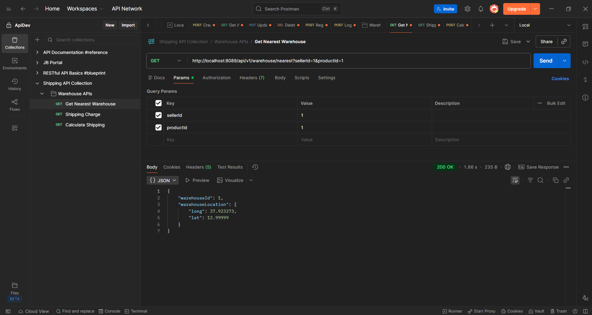
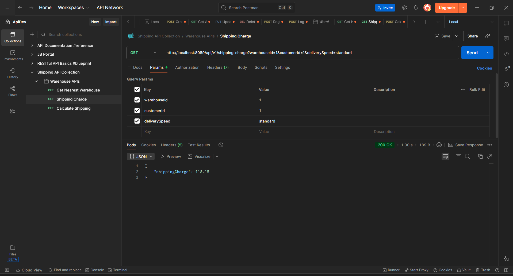
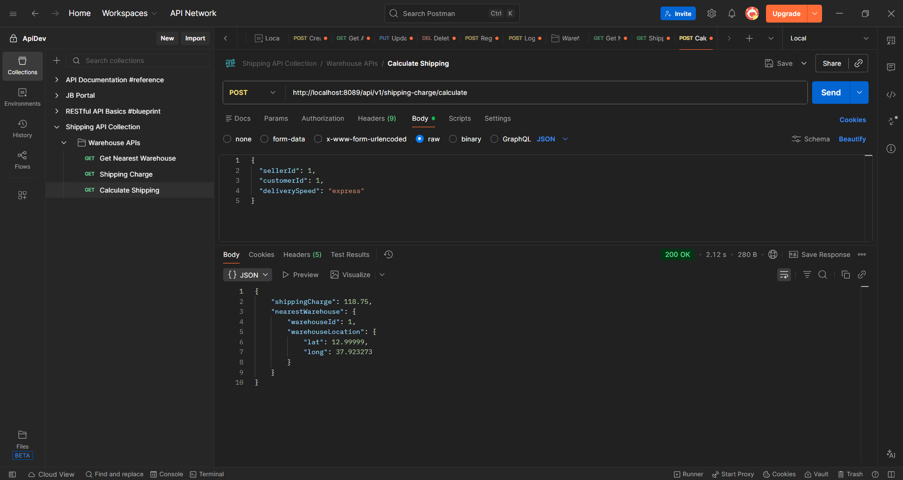

# 🚚 Shipping Charge Estimator API (Spring Boot | Geolocation Based)

🔗 Live API: Coming Soon (Currently runs on localhost)  
📂 GitHub Repo: https://github.com/aishwaryabehare1504/shipping-charge-estimator  

---

## 📋 Project Overview

A backend REST API that calculates shipping charges based on distance, product weight, and delivery speed.

💡 Demonstrates backend development, REST API design, geolocation-based logic, and clean layered architecture.

### It allows:
- Find nearest warehouse  
- Calculate shipping charges dynamically  
- Support multiple delivery speeds (standard, express)  
- Distance-based pricing using geo-coordinates  

---

## 🏗️ Architecture

### 🔹 Core Components

**1. Controller Layer**
- `ShippingController.java`
- `WarehouseController.java`

**2. Service Layer**
- `ShippingService.java`
- `WarehouseService.java`

**3. Model / DTO**
- `CalculateShippingRequest.java`
- `ShippingChargeResponse.java`
- `DeliverySpeed.java`

**4. Entity Layer**
- `Customer.java`
- `Seller.java`
- `Product.java`
- `Warehouse.java`

**5. Repository Layer**
- `CustomerRepository.java`
- `SellerRepository.java`
- `ProductRepository.java`
- `WarehouseRepository.java`

**6. Utility**
- `DistanceUtil.java`

**7. Exception Handling**
- `GlobalExceptionHandler.java`
- `ResourceNotFoundException.java`

---

## 🚀 Features

- Nearest warehouse detection  
- Distance-based shipping calculation  
- Express delivery pricing  
- Haversine formula for geo distance  
- RESTful API design  
- Global exception handling  
- Clean backend structure  

---

## 📸 API Screenshots

### 🔹 Get Nearest Warehouse


### 🔹 Get Shipping Charge


### 🔹 Calculate Shipping


---

## 📁 Project Structure

```
com.shipping
│
├── controller
│ ├── ShippingController.java
│ └── WarehouseController.java
│
├── dto
│ ├── CalculateShippingRequest.java
│ ├── DeliverySpeed.java
│ └── ShippingChargeResponse.java
│
├── entity
│ ├── Customer.java
│ ├── Product.java
│ ├── Seller.java
│ └── Warehouse.java
│
├── exception
│ ├── GlobalExceptionHandler.java
│ └── ResourceNotFoundException.java
│
├── repository
│ ├── CustomerRepository.java
│ ├── ProductRepository.java
│ ├── SellerRepository.java
│ └── WarehouseRepository.java
│
├── service
│ ├── ShippingService.java
│ ├── WarehouseService.java
│ └── impl
│ ├── ShippingServiceImpl.java
│ └── WarehouseServiceImpl.java
│
└── util
└── DistanceUtil.java
```

---

## ⚙️ Tech Stack

- Spring Boot  
- Java  
- Spring Data JPA  
- MySQL  
- Lombok  
- Maven  

---

## 🔧 Configuration


server.port=8089

spring.datasource.url=${DB_URL}
spring.datasource.username=${DB_USERNAME}
spring.datasource.password=${DB_PASSWORD}

spring.jpa.hibernate.ddl-auto=update
spring.jpa.show-sql=true


Or using environment variables:


DB_URL=your_db_url
DB_USERNAME=your_username
DB_PASSWORD=your_password


---

## 🚀 API Endpoint

### 📦 Warehouse API
- GET /api/v1/warehouse/nearest?sellerId=1&productId=1  

### 🚚 Shipping APIs
- GET /api/v1/shipping-charge?warehouseId=1&customerId=1&deliverySpeed=standard  
- POST /api/v1/shipping-charge/calculate  

---

## 💡 Sample Request

```json
{
  "sellerId": 1,
  "customerId": 1,
  "deliverySpeed": "express"
}
```
## 💡 Sample Response

```json
{
  "shippingCharge": 118.75,
  "nearestWarehouse": {
    "warehouseId": 1,
    "warehouseLocation": {
      "lat": 12.99999,
      "long": 37.923273
    }
  }
}
```

---

## 🔒 Security

- Database credentials stored using environment variables
- No hardcoded sensitive data

---

## 🚨 Challenges

- Implementing geolocation logic
- Designing distance-based pricing
- Handling nested JSON responses
- Maintaining clean architecture

---

## 📈 Future Enhancements

- Product-based dynamic pricing
- Multi-warehouse optimization
- Caching for performance
- Dockerization
- Deployment
- Authentication system

---

## 🤝 Contributing

📌 This project is built for learning and demonstration purposes.

Currently, contributions are not open. However, suggestions and feedback are welcome.

---

## 📄 License

This project is for learning and demonstration purposes only.

---

## 🔗 Connect

- GitHub: https://github.com/aishwaryabehare1504
- LinkedIn: https://www.linkedin.com/in/aishwarya-behare-45191b307/

---

## ❤️ Built With

Java + Spring Boot + JPA + MySQL
